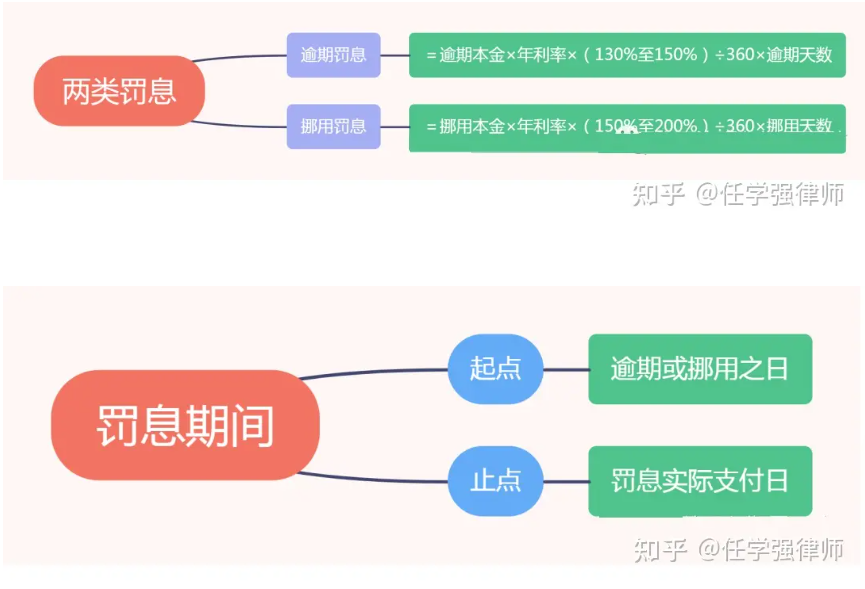

# 银行部分规则
## 一个成熟的商业银行信贷管理系统，在分期还款中，新的一期还款将在当期还款结清时立刻自动创建，还是在当期还款期限到达时自动创建？
在一个成熟的商业银行信贷管理系统中，新的一期还款通常会在当期还款结清时立即自动创建，而不是在当期还款期限到达时才创建。  
在分期还款贷款中，每一期的还款通常与前一期的还款结清相关联。一旦借款人成功偿还了当前期限的还款金额，系统会自动将下一期的还款创建并进入借款人的账户。  
这种立即创建下一期还款的方式有助于确保借款人能够及时了解下一期还款金额和截止日期，并为其提供足够的时间来进行还款准备。  

## 贷款展期的规则
贷款展期是指在贷款到期日之前延长贷款的期限。贷款展期的规则可以因不同的金融机构和贷款类型而异，但通常涉及以下一些常见规则：  
**申请条件**：通常需要借款人满足一定的条件才能申请贷款展期。这可能包括及时还款记录、良好的信用评级以及满足特定的贷款产品要求。  
**费用和利率**：贷款展期通常会涉及额外的费用和利率。借款人可能需要支付展期费用，并且新的利率可能与原始贷款的利率有所不同。具体的费用和利率取决于金融机构和贷款协议。  
**展期期限**：贷款展期的期限可以根据借款人的需求和金融机构的政策而定。展期期限可能是固定的，也可能是可以协商的。  
**申请流程**：通常，借款人需要向贷款机构提交贷款展期申请。申请流程可能包括填写申请表格、提供必要的文件和材料，并可能需要进行信用评估和审核。  
**条款和条件**：贷款展期通常需要借款人同意和签署贷款展期协议，其中包含了新的还款计划、费用和利率等条款和条件。借款人需要仔细阅读和理解贷款展期协议，并确保自己明确了解所有的权益和义务。
### 贷款展期通常会涉及的额外费用，通常是如何计算这部分费用的？
贷款展期是指在贷款到期日之前延长贷款期限的一种安排。在进行贷款展期时，通常会涉及一些额外费用。具体的额外费用和计算方法可能因金融机构和贷款协议而有所不同，以下是一些常见的情况：  
**展期手续费**：金融机构可能会收取展期手续费作为延长贷款期限的费用。展期手续费通常是根据贷款金额或展期金额的百分比来计算的。例如，手续费可能是贷款金额的1%或展期金额的0.5%。  
**利息调整**：贷款展期会导致贷款期限的延长，因此金融机构可能会对展期期间的利息进行调整。利息调整的计算方法可能因金融机构而异，有些机构可能会根据展期金额和展期期限重新计算利息。  
**其他费用**：除了展期手续费和利息调整外，金融机构还可能收取其他相关费用，如行政费用、文件处理费用或评估费用等。这些费用的计算方法和金额可能因机构而异。  
### 通常允许延长的期限是？
通常情况下，贷款延长的期限是根据借款人和金融机构之间的协商而确定的。具体允许延长的期限可能因金融机构的政策、贷款类型和贷款合同的条款而有所不同。  
在商业银行信贷管理系统中，贷款延长的期限可以是几个月、半年或一年，具体取决于双方的协商和金融机构的政策。有时候，金融机构可能会根据借款人的具体情况和还款能力来决定延长的期限。  
值得注意的是，贷款延长的期限通常需要与金融机构提前沟通，并且需要在原贷款到期日之前就行协商和达成一致。否则，如果贷款到期后未能按时偿还，将可能导致逾期和相关的逾期费用。

## 贷款逾期的规则
贷款逾期是指借款人未按照贷款合同规定的时间和金额进行偿还的情况。贷款逾期的规则可以因不同的金融机构和贷款类型而异，但通常涉及以下一些常见规则：  
**逾期定义**：金融机构通常将贷款逾期定义为借款人未按合同规定的还款日期偿还贷款的情况。逾期可能是部分逾期（未支付全部应还款金额）或完全逾期（未支付任何应还款金额）。  
**逾期期限**：贷款逾期可能根据金融机构和贷款协议而有所不同。通常，借款人在逾期后会有一段宽限期，金融机构可能会收取逾期利息和滞纳金。如果借款人在宽限期结束后仍未还款，金融机构可能会采取进一步的行动，如采取追讨措施。  
**逾期费用和利率**：贷款逾期通常会涉及额外的费用和利率。金融机构可能会收取逾期利息和滞纳金，这些费用通常高于正常还款利率。具体的费用和利率取决于金融机构和贷款协议。  
**影响信用记录**：贷款逾期可能会对借款人的信用记录产生负面影响。逾期记录可能会被报告给信用机构，对借款人的信用评级和信用历史产生不利影响。这可能会对借款人未来申请贷款、信用卡等金融产品产生影响。  
**追讨措施**：如果借款人长时间未偿还贷款，金融机构可能会采取进一步的行动来追讨欠款。这可能包括催收电话、逾期通知函、法律诉讼以及可能导致资产查封或拍卖等追讨措施。  
### 通常逾期罚息是怎么计算的？
通常情况下，逾期罚息是根据逾期金额和逾期天数计算的。具体的计算方法可能因金融机构和贷款协议而有所不同，但以下是一种常见的逾期罚息计算方法：  
确定逾期金额：逾期金额是指借款人未按期偿还的贷款本金和利息。通常，在逾期开始后，未偿还的本金和利息将被视为逾期金额。  
确定逾期天数：逾期天数是指借款人超过合同规定的还款日期的天数。通常，逾期天数从还款日期的次日开始计算。  
确定逾期利率：逾期利率是逾期罚息所采用的利率，通常高于正常还款利率。逾期利率可能在贷款合同中明确规定，也可能根据金融机构的政策而有所不同。  
计算逾期罚息：逾期罚息通常按照逾期金额和逾期天数以及逾期利率计算。一种常见的计算方法是按日计息，将逾期金额乘以逾期利率，然后乘以逾期天数得到逾期罚息金额。  

  

### 假设小明贷款100000元，分十期等额本息还款，约定每个月月底25号还当期金额。作为一个成熟的商业银行信贷管理系统，如果小明当期1月25号正常还款，那么下一期还款期限将在2月25号。可是1月25号时，小明逾期未结清当期还款，那么下一期的贷款期限是？  
根据您的描述，小明的贷款分为十期等额本息还款，约定每个月月底25号还当期金额。如果小明在1月25日逾期未结清当期还款，下一期的贷款期限将会受到影响。  
通常情况下，如果借款人未能按时偿还当期还款，金融机构可能会采取逾期处理措施，并要求借款人尽快偿还逾期金额。具体的逾期处理程序可能因金融机构和贷款协议而有所不同。  
在这种情况下，下一期的贷款期限会根据金融机构的政策来确定。金融机构可能会采取以下一些可能的做法：  
**延长还款期限**：金融机构可能会将下一期的还款期限延长，以给借款人更多时间偿还逾期金额。具体的延长期限取决于金融机构的政策和协议。  
**调整还款计划**：金融机构可能会与借款人协商调整还款计划，例如将逾期金额分摊到未来几期还款中，使借款人能够逐步偿还逾期金额。  
**加收逾期费用**：金融机构可能会根据逾期天数和逾期金额收取逾期费用，这将增加借款人的还款负担。  

### 商业银行为客户可提供的贷款额度应该参考哪些因素？
商业银行在确定客户可提供的贷款额度时通常会考虑以下因素：  
**信用评估**：银行会评估客户的信用状况，包括信用记录、还款历史、逾期情况等。较好的信用状况通常会获得更高的贷款额度。  
**收入稳定性**：银行会评估客户的收入来源和稳定性。稳定的收入来源，如固定工作或稳定的经营收入，可以增加客户的还款能力，从而有助于获得更高的贷款额度。  
**债务负担**：银行会考虑客户当前的债务负担，包括其他贷款、信用卡债务和其他债务。过高的债务负担可能会限制客户的还款能力，从而影响贷款额度。  
**资产情况**：银行可能会考虑客户的资产情况，如房产、车辆、储蓄和投资等。较高价值的资产可以作为担保或提供额外的还款保障，有助于获得更高的贷款额度。  
**行业和职业**：银行通常会考虑客户所在的行业和职业类型。某些行业或职业可能具有更稳定的收入和较低的风险，因此可能获得更高的贷款额度。  
**贷款用途**：银行会考虑客户的贷款用途。不同的贷款用途可能有不同的风险和回报特征，银行会根据风险偏好和战略考虑是否提供相应的贷款额度。  
以上因素只是一些常见的考虑因素，实际情况可能因银行的政策和要求而有所不同。银行通常会综合考虑这些因素，并在风险管理框架内进行决策，以确保贷款的安全性和合规性。

### 一个成熟的商业银行信贷管理系统会如何对客户的信用等级进行评估？
一个成熟的商业银行信贷管理系统通常会采用多种方法和指标来评估客户的信用等级。以下是一些常见的评估方法和指标：  
**信用报告和信用评分**：银行会获取客户的信用报告，其中包含客户的信用历史、负债情况、还款记录等信息。通过对这些信息进行分析，可以生成一个信用评分，用于评估客户的信用等级。信用评分通常基于统计模型，考虑诸如还款记录、负债比率、使用信用额度的情况等因素。  
**收入和就业情况**：银行通常会评估客户的收入水平和就业状况。这包括客户的工资收入、其他收入来源、就业类型（例如全职、兼职、自雇等）以及就业稳定性等。较高的稳定收入和稳定的就业状况有助于提高客户的信用等级。  
**资产和负债情况**：银行会考虑客户的资产和负债情况。资产包括房产、车辆、储蓄和投资等，而负债包括贷款、信用卡债务和其他债务。客户的资产净值和负债比率可以提供关于其财务状况和偿债能力的信息。  
**历史贷款记录**：银行会考虑客户过去的贷款记录，包括还款准时性、逾期记录和违约情况等。较好的还款历史和无违约记录可以提高客户的信用等级。  
**行为分析**：银行可能会通过分析客户的交易记录和消费行为来评估其信用等级。这可能包括客户的支出模式、支付习惯、账户余额和交易频率等。  
以上仅是一些常见的评估方法和指标，不同的银行和信贷管理系统可能会在评估客户信用等级时采用不同的方法和加权指标。评估客户信用等级的过程通常是综合考虑多个因素，并结合风险管理策略和银行的政策和标准进行决策。  
需要注意的是，具体的信用评估方法可能因银行和地区而异。此外，随着技术的进步，一些银行还探索使用人工智能和机器学习等技术来改进信用评估的准确性和效率。

### 客户的资产净值和负债比率如何评估？
评估客户的资产净值和负债比率是确定其信用等级的重要指标。以下是一种常见的评估方法：  
**资产净值评估**：  
资产净值是客户的总资产减去总负债后的余额，是客户的净资产价值。评估客户的资产净值可以通过以下步骤进行：  
**计算客户的总资产**：包括不动产、动产、投资、存款等各种资产的总价值。  
**计算客户的总负债**：包括贷款、信用卡欠款、其他债务的总额。  
**计算资产净值**：将总资产减去总负债得到资产净值。  
您可以根据资产净值的范围为客户分配相应的评分，并据此评估客户的信用等级。通常，较高的资产净值表示客户有更多的净资产，可能降低信用风险。  
**负债比率评估**：  
负债比率是客户的总负债与总资产的比率，反映了客户的负债相对于资产的比重。评估客户的负债比率可以通过以下步骤进行：  
**计算客户的总资产**：与资产净值评估中相同，计算客户的总资产。  
**计算客户的总负债**：与资产净值评估中相同，计算客户的总负债。  
**计算负债比率**：将总负债除以总资产得到负债比率。  
负债比率的高低可以反映客户的负债水平和偿债能力。通常情况下，较低的负债比率表示客户负债相对较少，可能降低信用风险。  
对于资产净值和负债比率的评估，您可以根据具体业务需求和风险偏好设置不同的评分标准和权重。例如，您可以将资产净值和负债比率分成几个范围，并为每个范围分配相应的分数，然后根据得分来确定客户的信用等级。  

### 债务负担参考因素
在评估客户的收入稳定性时，债务负担是一个重要的考虑因素。以下是评估债务负担时可能参考的一些因素：  
**债务收入比**（Debt-to-Income Ratio）：债务收入比是客户的债务支付能力的一个重要指标。它是客户的债务支付总额与其总收入之间的比率。较高的债务收入比可能意味着客户用于债务还款的收入比例较高，可能对其收入稳定性产生负面影响。  
**债务种类**：银行还会考虑客户的债务种类。不同类型的债务有不同的偿还条件和风险特征。例如，高利率的消费性债务可能对客户的现金流产生较大压力，而低利率的抵押贷款可能具有较低的风险。  
**债务历史**：银行会考虑客户的债务历史，包括过去的还款记录和信用报告中的债务信息。客户的还款记录和信用状况可以反映其债务管理能力和还款意愿。  
**债务类型和期限**：银行会考虑客户的债务类型和债务期限。长期债务（如抵押贷款）通常具有较低的月度还款压力，而短期债务（如信用卡债务）可能对现金流产生更大的影响。  
**债务偿还计划**：银行会考虑客户的债务偿还计划，包括每月还款金额和还款期限。客户能否按时偿还债务以及还款计划的合理性对银行来说是重要的。

### 债务收入比如何计算
债务收入比（Debt-to-Income Ratio，简称DTI）是用来衡量个人或家庭债务支付能力的指标，计算方法是将债务支付总额与总收入进行比较。以下是计算债务收入比的一般步骤：  
确定债务支付总额：将个人或家庭的所有债务支付总额加起来。这包括每月的抵押贷款还款、车贷还款、信用卡最低还款、学生贷款还款以及其他债务的还款金额。确保考虑到所有债务支付，包括固定和可变的还款金额。  
确定总收入：确定个人或家庭的总收入。这包括工资、自营收入、租金收入、投资收益等所有可靠的收入来源。确保考虑到所有可用的收入来源。  
计算债务收入比：将债务支付总额除以总收入，并将结果乘以100，以得到百分比形式的债务收入比。计算公式如下：  
**DTI = (债务支付总额 / 总收入) × 100**  
例如，假设一个家庭每月的债务支付总额为5000美元，总收入为10000美元，那么债务收入比为：  
DTI = (5000 / 10000) × 100 = 50%  

这意味着该家庭每月的债务支付占总收入的50%。  
债务收入比的计算可以帮助评估一个人或家庭的债务负担水平。较高的债务收入比可能表示债务偿还压力较大，可能对还款能力和财务稳定性产生负面影响。  

好的，添加不良贷款率是一个很好的补充，因为它能帮助评估银行的资产质量和风险状况。下面是更新后的财务汇总报表，包括不良贷款率。

### 财务汇总报表

#### 1. 总览部分
- **报告日期范围**：2024年1月1日至2024年3月31日
- **货币单位**：人民币（CNY）

#### 2. 利润表

| 项目               | 金额 (CNY)    |
| ------------------ | ------------- |
| **收入**           |               |
| - 利息收入         | 5,000,000     |
| - 手续费及佣金收入 | 1,200,000     |
| - 其他收入         | 300,000       |
| **总收入**         | **6,500,000** |
| **费用**           |               |
| - 利息费用         | 2,000,000     |
| - 手续费及佣金支出 | 600,000       |
| - 运营费用         | 1,500,000     |
| **总费用**         | **4,100,000** |
| **净利润**         | **2,400,000** |

#### 3. 关键财务比率

| 比率                      | 计算公式/说明       | 比率值 |
| ------------------------- | ------------------- | ------ |
| **流动比率**              | 流动资产 / 流动负债 | 1.5    |
| **速动比率**              | 速动资产 / 流动负债 | 1.2    |
| **资产收益率（ROA）**     | 净利润 / 总资产     | 2.4%   |
| **股东权益回报率（ROE）** | 净利润 / 股东权益   | 8.0%   |
| **净利率**                | 净利润 / 总收入     | 36.9%  |
| **不良贷款率**            | 不良贷款 / 总贷款   | 1.8%   |

#### 4. 图表和可视化

- **收入趋势图**：

  ![收入趋势图][]  - **净利润趋势图**：  ![净利润趋势图][]  - **关键财务比率图**：  ![关键财务比率图][]通过添加不良贷款率，你的报表将能够更全面地反映银行的资产质量和风险管理效果，有助于更全面地评估银行的财务健康状况。

### 什么是不良贷款？

不良贷款(Non-Performing Loans, NPLs)是指借款人未能按时偿还贷款本金和利息,且已逾期90天以上的贷款。这类贷款对银行的资产质量和经营业绩会造成严重影响。
